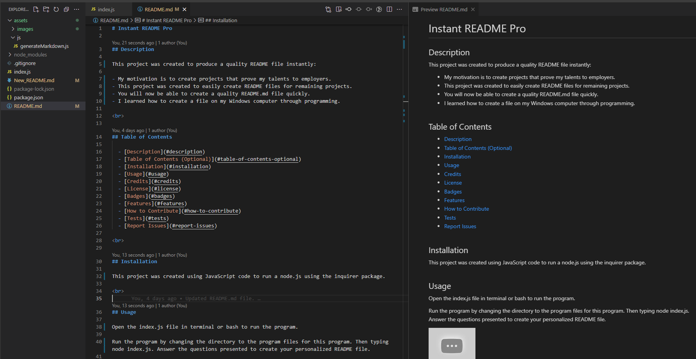

# Instant README Pro

## Description

This project was created to produce a quality README file instantly:

- My motivation is to create projects that prove my talents to employers.
- This project was created to easily create README files for remaining projects.
- You will now be able to create a quality README.md file quickly.
- I learned how to create a file on my Windows computer through programming.

 

## Table of Contents

  - [Description](#description)
  - [Table of Contents (Optional)](#table-of-contents-optional)
  - [Installation](#installation)
  - [Usage](#usage)
  - [Credits](#credits)
  - [License](#license)
  - [Badges](#badges)
  - [Features](#features)
  - [How to Contribute](#how-to-contribute)
  - [Tests](#tests)
  - [Report Issues](#report-issues)

 

## Installation

This project was created using JavaScript code to run a node.js using the inquirer package.

 

## Usage

Open the index.js file in terminal or bash to run the program.

Run the program by changing the directory to the program files for this program. Then typing node index.js. Answer the questions presented to create your personalized README file.

)

 

## Credits

List your collaborators, if any, with links to their GitHub profiles.

If you used any third-party assets that require attribution, list the creators with links to their primary web presence in this section.

If you followed tutorials, include links to those here as well.

 

## License

The last section of a high-quality README file is the license. This lets other developers know what they can and cannot do with your project. If you need help choosing a license, refer to [https://choosealicense.com/](https://choosealicense.com/).

 

## Badges

Badges aren't necessary, per se, but they demonstrate street cred. Badges let other developers know that you know what you're doing. Check out the badges hosted by [shields.io](https://shields.io/). You may not understand what they all represent now, but you will in time.

 

## Features

Lorem ipsum dolor, sit amet consectetur adipisicing elit. Iste nemo commodi molestiae nihil. Veritatis sint libero magni sequi, facilis distinctio assumenda natus iusto inventore dolorem! Esse amet, rerum omnis, nobis molestiae earum porro delectus, accusantium saepe nemo quidem. Possimus, cum?

 

## How to Contribute

If you created an application or package and would like other developers to contribute it, you can include guidelines for how to do so. The [Contributor Covenant](https://www.contributor-covenant.org/) is an industry standard, but you can always write your own if you'd prefer.

 

## Tests

Lorem ipsum dolor, sit amet consectetur adipisicing elit. Iste nemo commodi molestiae nihil. Veritatis sint libero magni sequi, facilis distinctio assumenda natus iusto inventore dolorem! Esse amet, rerum omnis, nobis molestiae earum porro delectus, accusantium saepe nemo quidem. Possimus, cum?

 

## Issue Reporting

Report issues on this applications GitHub repository.

Issue Reporting: https://github.com/kthomasnj/Instant-README-Pro/issues

 

## Future Development

Lorem ipsum dolor, sit amet consectetur adipisicing elit. Iste nemo commodi molestiae nihil. Veritatis sint libero magni sequi, facilis distinctio assumenda natus iusto inventore dolorem! Esse amet, rerum omnis, nobis molestiae earum porro delectus, accusantium saepe nemo quidem. Possimus, cum?